# Rapport de projet - CanBankX Phase 1

### Table des matières.
1. Introduction  
    1.1. Définition  
    1.2. Choix de languages  
    1.3. Objectifs d'apprentissage
2. Analyse métier - Réflexion sur le cahier des charges
3. Architectures et décisions  
  3.1. Vue physique - Diagramme de déploiement  
  3.2. Vue Logique - Diagrammes de classes  
  3.3. Vue Développement - Diagramme de développement  
  3.4. Vue Processus - Définitions des cas d'utilisation   
4. Notes sur l'observabilité
5. Conteneurisation  
    5.1. Composition des docker  
    5.2. CI/CD
6. Documentation de l'API REST
7. Réflexion sur le travail réalisé et les étapes suivantes
___
## 1. Introduction

Ce projet s'inscrit dans le cadre du cour LOG430 - Architecture logiciel. L'objectif de ce cour est d'apprendre à l'étudiant à documenter une architecture logicielle, analyser une architecture logicielle et concevoir une architecture logicielle. Alors que la majorité des cours de l'ÉTS sont données par instructions où une grille d'évaluation détaillée permet aux étudiants de comprendre le travail étapes par étapes et si l'ensemble des étapes sont exécutées les points sont données. Ce cours, et particulièrement avec l'enseignant Fabio Petrillo, tient à travailler différement. Le but est de développer un jugement décisionnel face à la réalisation d'un logiciel et de son architecture. Conséquemment ce rapport ne tient pas seulement à expliquer le développement logiciel qui a été exécuté, mais bien de justifier et de transmettre la prise de décision réalisée au courant de l'exercice.  

Dans cette lignée reflexionnelle, il est important de souligner les intentions de réalisation pour ce projet. Certe, plusieurs exigences sont mentionnées dans le cahier des charges ainsi que dans la description du projet sur Moodle. Toutefois, lors de la réalsisation de celles-ci, l'idée de pouvoir apprendre est restée au coeur de la prise de décision. Certainement, des méthodes et des décisions auraient pu simplifier la réalisation des cas d'utilisation et même créer un projet plus pointus, plus performant ou au goût du jour concernant le logiciel. Toutefois, ce projet est réalisé dans un cadre scolaire et il est important de comprendre la chance de pouvoir essayer des choses en apprenant. Cette mention est faite dans l'optique que le jugement de se travail concerve l'essence de la personne qui l'a réalisé.  
___

### 1.1 Définitions

Ce section tient à décrire les définitions des éléments indiqués dans l'énoncé de laboratoire.

### Lexique générale
* **Framework**: Struture logicielle qui dicte la rédaction du code et de sa logique. Peut être composé de librairies.
* **Librairie**: Ensemble de classes et de fonctions pouvant être utilisées lors de l'exécution de tâches et logiques spécifiques.
* **Service**: Instance active de code qui utilise des frameworks et des librairies pour offrir un service.

### Lexique du contexte
* **API**: (Application Programming Interface) Ensemeble de règles et protocoles qui permettent à deux logiciels d'intéragir entre eux. 
* **API Gateway**: *Reverse proxy* L'API Gateway se situe entre un client et une collection de BackEnd. Il permet l'utilisation d'une multitudes d'API par lesquels un utilisateur voit de l'information. (Service based architecture).
* **API RESTful**: Interface qui permet la communication entre différentes application via le WEB.
* **Arc42**: Gabarit pour la documentation d'un logiciel.
* **Basic Auth**: Authentification de base, la paramètres sont envoyés dans le header de la requête.
* **CORS**: Cross-Origin Resource Sharing. Assure la conformité de l'échange des ressources entre les différentes origines d'une application.
* **DDD**: Domain-driven design. Design piloté par le cahier des charges.
* **Grafana**: Permet la représentation des données dans des dashboards.
* **JWT**: (JSON Web Token) Méthode d'authentification par jeton qui premet de transmettre de l'information en formet JSON entre deux entités. Communément utiliser par les APIs et les microservices. 
* **Kong/KrakenD/Spring Cloud Gateway**: Direction vers les microservices. Outils d'APIGateway. 
* **K6/JMeter**: Outils de tests de charge. Cet outil serviront au load balancing. K6 est la version moderne et JMeter est le vétéran.
* **Middelware**: Code entre deux couches d'un logiciel. Par exemple, du code qui s'applique sur toutes les requêtes HTTP de l'application.
* **NFR**: Non-fonctional Requirements, exigence de qualité (Quality attributes) QA Architeture
* **NGINX/HAProxy/Traefik**: outils de load balancing, permet de séparer les charges. Facilite le scaling de l'application.
* **OpenAPI/Swagger**: (Noter que OpenAPI et Swagger sont la même chose) Outil servant à la spécification d'un APIRest. Il s'agit d'un fichier JSON qui décrit les endpoints, les méthodes hTTP, les paramètres d'accès ainsi que les réponses possibles.
* **Prometheus Metric**: Metrique composée de trois éléments qui permettent la création d'un log affichant le nom, les labels et la valeur.
* **REST**: (Representational State Transfer) Style d'architecture permettant des interactions entre des services web.
* **4 Golden Signal**s: Principe par lequel quatre éléments d'un logiciel devrait être observés. Ces éléments sont les suivant: la latence, le trafic, les erreurs et la saturation. 
* **4+1**: Gabarit pour la documentation d'un logiciel qui décrit quatre composantes générales qui forme un ensemble de documentation. 
___
### 1.2 Choix de langages

**Choix de langages de base**  
Considérant le cadre scolaire du projet et le parcour professionel de la personne qui réalise ce projet. Le langage de programmation choisi est C#. La documentation est exhaustive et l'integration du minimal API permet de conserver un code clair lors de l'implementation de microservices. De plus, ce langage contient des packages pour l'ensemble des exigences de l'énoncé de projet sur Moodle. L'intégration des fonctionnalités exigées peut-être réalisée aisément.

**Base de données**  
Une base de données relationnelles est primordiale pour la réalisation d'une banque. L'idée est de pouvoir enregistrer des données avec une persistence et une intégrité. Les restrictions imposées par une base de données relationnelle facilite l'intégration des principes ACID. 

Alors que le choix intuitifs pour l'intégration du base de données en C# est SSMS considérant l'environnement windows, le choix fait est de prendre MySQL pour sa simplicité d'intégration et de déploiement. Le perte de performance est minime et le temps de déploiement est moins long. Dans le cadre de ce projet, MySQL est l'idéal.

**REST API**  
Pour l'API REST ainsi que le Gateway, ASP.NET permet l'intégration des fonctionnalités demandées de manière organique. L'entiereté des fontionnalités peuvent être intégrés à l'aide de package tel que YARP ou Swagger. La configuration est simple et permet l'intégration microservice sans avoir à passer par une architecture MVC. Pour plus d'informations concernant la compréhension de ASP.NET ces deux articles ont été consultés:

https://medium.com/@NAC59/the-difference-between-spring-boot-and-asp-net-core-a747d78a1687
https://www.reddit.com/r/dotnet/comments/13z8b0p/what_are_the_proper_benefits_of_asp_dotnet_core/
___
### 1.3 Objectifs d'apprentissage.
Les objectifs sont sousmentionnés et des notes aux objectifs se trouvent en dessous de chacun d'eux.  

* Exposer une API RESTful conforme aux bonnes pratiques, documentée (OpenAPI/Swagger), sécurisée (CORS, auth de base/JWT).  
 -Les routes sont définies avec OpenAPI et Swagger. Plus de détails concernant point seront développés dans les sections suivantes.  
 -Auth de base a été réalisé à l'aide de guid. Le but était de comprendre le fonctionnement d'une session. Plus de détails concernant ce point dans les sections suivantes.
* Mettre en place l’observabilité (logs structurés, métriques Prometheus, dashboards Grafana) et mesurer les 4 Golden Signals sous charge réaliste (k6/JMeter).  
-A faire
* Optimiser la performance par load balancing (NGINX/HAProxy/Traefik) et caching (mémoire/Redis) sur endpoints critiques.  
-A faire
* Implémenter des microservices et publier via une API Gateway (Kong/KrakenD/Spring Cloud Gateway), avec routage, sécurité et comparaisons A/B (direct vs gateway).  
-Considérant l'environnement C#, pour réaliser le Gateway, YARP a été utilisé. La différence entre direct vs gateway est en dehors du périmètre de ce travail. Aucune migration de monolithique vers microservice n'a été produite.
* Respecter le cahier de charge : domaines (Comptes & Clients, Ordres & Appariement, Données de marché, Portefeuilles), NFR (latence P95, throughput, disponibilité) et exigences de conformité/audit.  
-Ce point est décrit dans le section sur l'analyse métier dans les sections suivantes
* Maintenir la documentation architecturale (Arc42 + 4+1) et consigner les décisions (ADRs).  
-Voir secton 3.
___
## 2. Analyse métier - Réflexion sur le cahier des charges
L'ampleur de programmer une banque est intimidant. Plusieurs réflexions sur les exigences et les nécessités ont été produite afin de trouver un juste milieu entre l'apprentissage et les fonctionnalités essentiels à la réalisation du mandat. L'idée est de trouver la balance entre ce qui peut et ce qui doit être fait. Les exigences d'un banque concernant la sécurité, les échanges et la pérennité sont immenses et alors qu'il est irréaliste de concevoir et implémenter toutes ces fonctionnalités dans le cadre de ce projet, l'approche tentée ici est de présenter un départ en microservice qui permettera d'évoluer de manière concrète. Conséquemment, les domaines primordiaux retenus sont les suivants : 
* Entreposer d'argent. L'idée de pouvoir enregistrer son argent au prêt d'une entité afin de la conserver dans le temps.
* Échange d'argent. Permetter l'échange d'argent entre les membres d'une banque.
* Sécurité. La sécurité doit être omniprésente dans une banque.   

Cette constatation réalisée, il est plus simple d'émettre une décision face aux Cas d'Utilisations présentés.  

Le cahier des charges présente huit cas d'utilisation. Ceux retenus sont les suivants : 

    1. UC-01 - Inscription & Vérification d'identité
    2. UC-02 - Authentification & MFA
    3. UC-03 - Ouverture d’un compte bancaire
    4. UC-05 - Virement bancaire (interne / Interac simulé)
    7. UC-07 - Détection d’activités suspectes (AML)

En réalisant ces cinq cas d'utilisation, il est possible d'avoir les composantes de base pour implémenter les éléments futurs. En plus de couvrir les domaines primordiaux mentionnés.  

* UC-01 et UC-03 permettent d'entreposer de l'argent.  
* UC-05 permet d'échanger de l'argent
* UC-02 et UC-07 permettent d'assurer une sécurité.  

Aucun cas d'utilisation concernant la consultation des soldes et des transactions n'a été retenu. Cette décision est justifié par la simplicité de leur réalisation ainsi que leur priorité concernant les exigences de base d'une banque. Si je peux consulter des sommes qui ne sont pas sécurisé, elles peuvent ne pas rester. Ce n'est pas ce qui est attendu d'une banque. Je préfère pouvoir mettre de l'argent en sécurité que de voir de l'argent non sécurisé. Favoriser un service AML sur l'ensemble des services semble plus adapté au domaine. La consultation devra et sera implémentée ulterieurement.

## 3. Architectures et décisions  

**DIAGRAMME DES CAS D'UTILISATION (+1)**

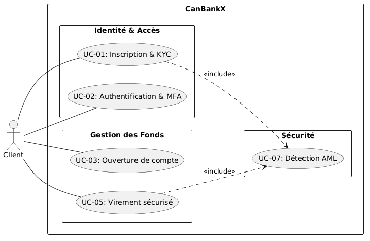

Ce diagramme tient à décrire la relation entre un acteur client et le service intentionné. Il est important de souligner l'inclusion du UC07 dans certains cas d'utilisation. Tel que décrit plus haut. Ces intentions tiennent à décrire les services offerts par une banque dont la sécurité. 


### 3.1. Vue physique - Diagramme de déploiement
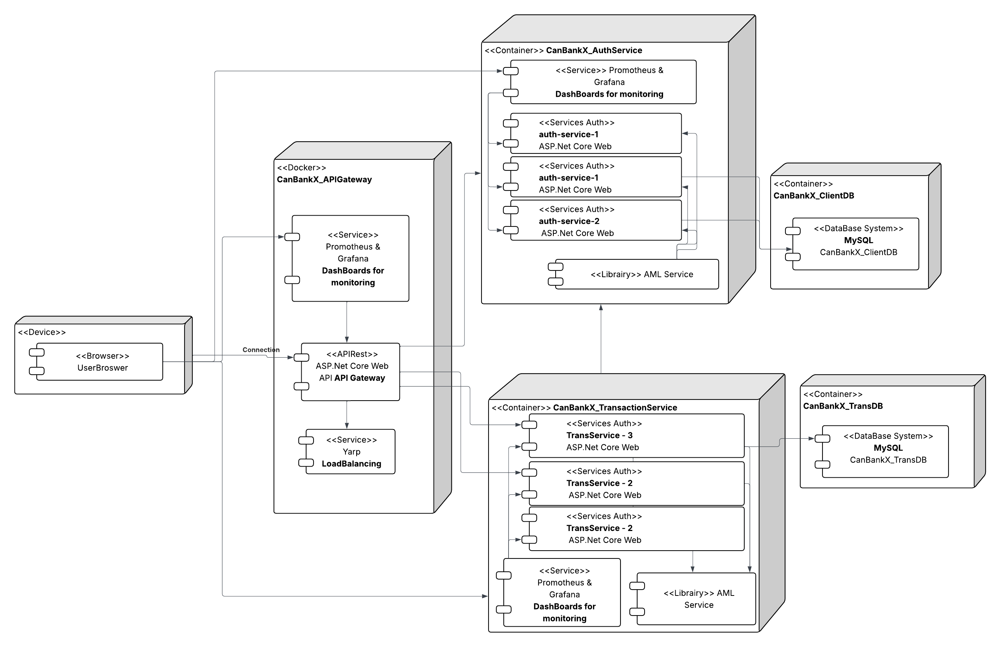


Le diagramme de déploiement tient à représenter l'architecture en microservices du système produit. Le découplement permet de séparer les services afin d'offrir une persistence des services. C'est d'ailleurs l'idée d'intégrer l'AMLService en tant que librairie au sein de l'architecture. La sécurité est au coeur du service conséquemment, si un service tombe elle tombe avec et elle en soit ne peut jamais tombée puis que ce n'est pas traiter comme un service. 

### 3.2. Vue Logique - Diagrammes de classes


**API_GATEWAY**
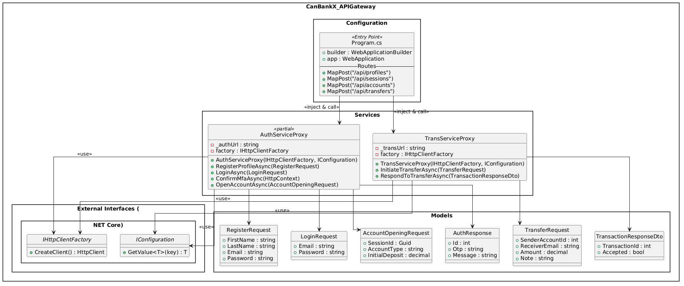

Le gateway est munis de deux proxy pour les deux services qui réalisent les cas d'utilisation. Ces deux proxy sont utilisés pour intéragir avec les deux microservices: auth-service et trans-service. La responsabilité est délégué de cette manière par l'api gateay.


**AuthService**

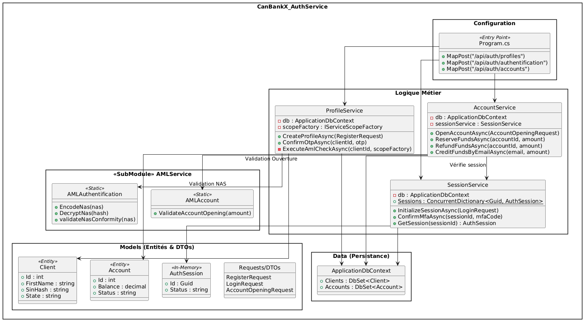

Comme décrit plus haut, authService est munis d'un submodule qui s'occupe de la sécurité des intéractions. Il est intégré au service afin d'assurer une persistence. Ce service ne peut pas tomber puisqu'il fait partie du service.

**TransService**

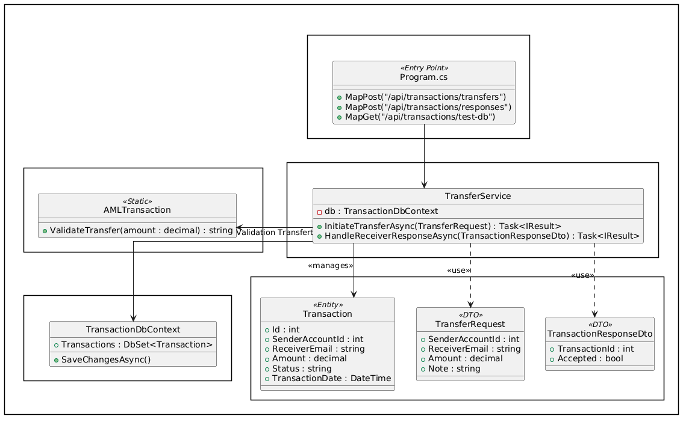

**AMLService**

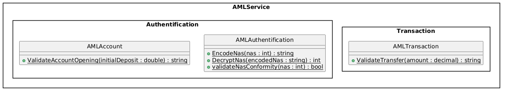

### 3.3. Vue Développement - Diagramme de développement

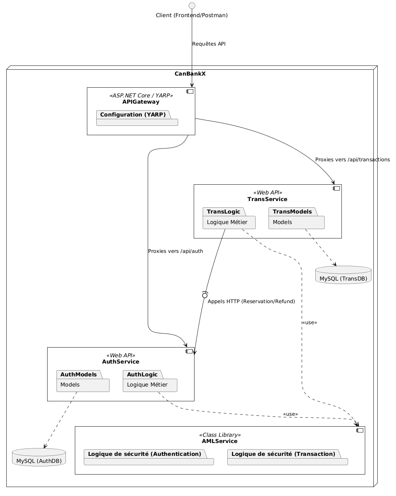

### 3.4. Vue Processus - Définitions des cas d'utilisation

**1. UC-01 - Inscription & Vérification d'identité**

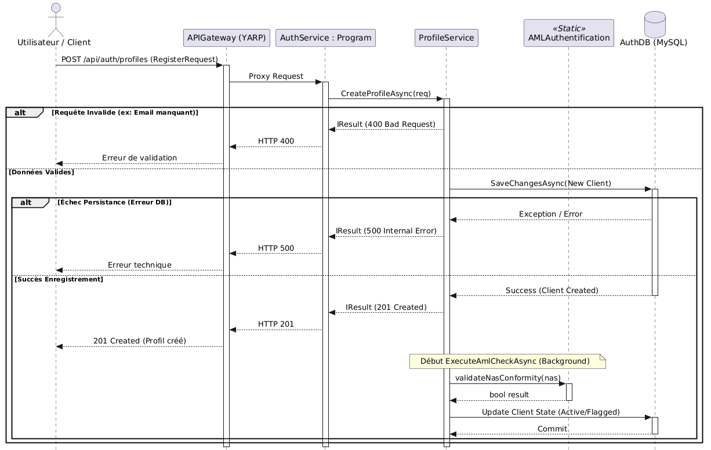

**2. UC-02 - Authentification & MFA**
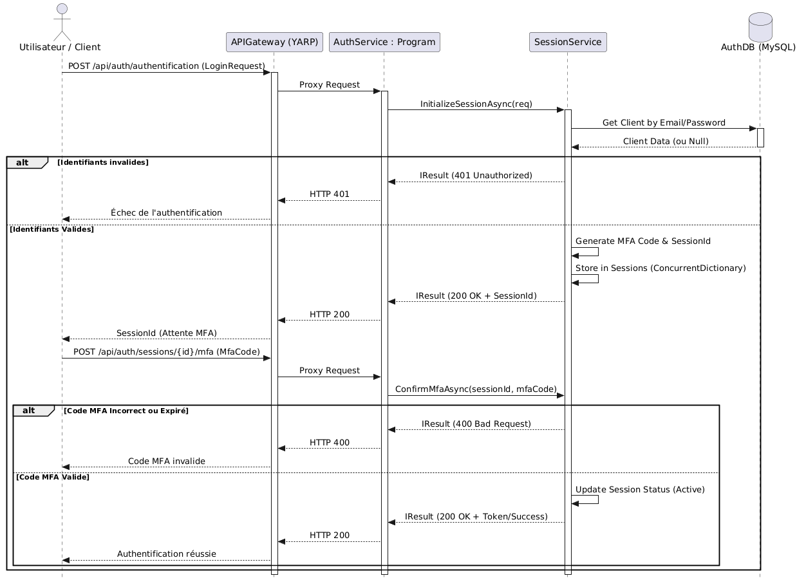

**3. UC-03 - Ouverture d’un compte bancaire**

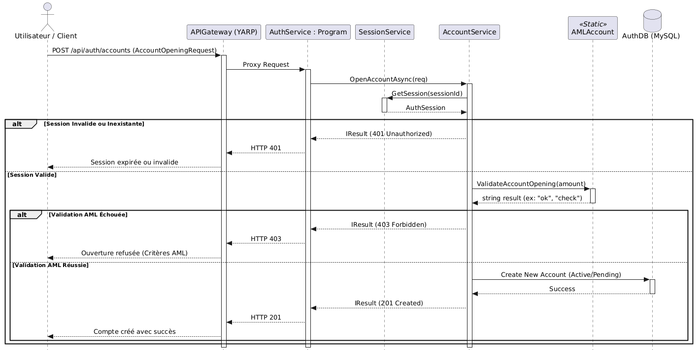

**4. UC-05 - Virement bancaire (interne / Interac simulé)**
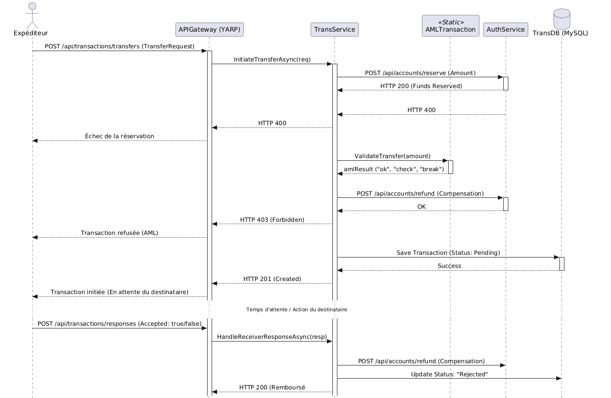

**5. UC-07 - Détection d’activités suspectes (AML)**
Ce cas d'utilisation est implicite dans les cas d'utilisation susmentionnés et est une partie essentiel des intentions d'architecture. L'idée est de faciliter l'intégration d'une architecture event-base à partir de ce service. En appelant la classe on devrait vérifier si l'AML est actif, s'il ne l'est pas le service de vient indisponible. C'est définitivement un élément qui sera implémenté dans la deuxième phase du projet. 

## 4. Observabilité

### 4.1 Prometheus & Grafana
Les services de prometheus & grafana ont été mis en place sur chacun des services actifs : Gateway,  Authentification et Transaction. 

Prometheus est actif aux addresses suivantes: 
Gateway : http://localhost:9090/query
AuthService : http://localhost:9091/query
Transaction : http://localhost:9092/query

Grafana est actif aux addresses suivantes: 
Gateway: http://localhost:3000/
AuthService : http://localhost:3001/
Transaction : http://localhost:3002/


### 4.2. Load balancer

Le load balancer a été programmé dans le yarp tel que : 

```
"Clusters": {
      "auth-cluster": {
        "LoadBalancingPolicy": "LeastRequests",
        "Destinations": {
          "auth-1": { "Address": "http://auth-service-1:8080" },
          "auth-2": { "Address": "http://auth-service-2:8080" },
          "auth-3": { "Address": "http://auth-service-3:8080" }
        },
        "HealthCheck": {
          "Active": {
            "Enabled": "true",
            "Interval": "00:00:10",
            "Timeout": "00:00:02",
            "Policy": "ConsecutiveFailures",
            "Path": "/health"
          }
        }
      },
      "trans-cluster": {
        "LoadBalancingPolicy": "LeastRequests",
        "Destinations": {
          "trans-1": { "Address": "http://transaction-service-1:8080" },
          "trans-2": { "Address": "http://transaction-service-2:8080" },
          "trans-3": { "Address": "http://transaction-service-3:8080" }
        },
        "HealthCheck": {
          "Active": {
            "Enabled": "true",
            "Interval": "00:00:10",
            "Timeout": "00:00:02",
            "Policy": "ConsecutiveFailures",
            "Path": "/health"
          }
        }
      }
    }

```

### 4.3. Test de charges
**APIGATEWAY**
Ecran Target Health Promotheus : 
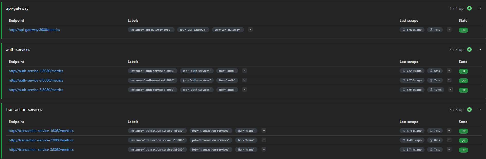

Ecran Grafana:
Pre test: 
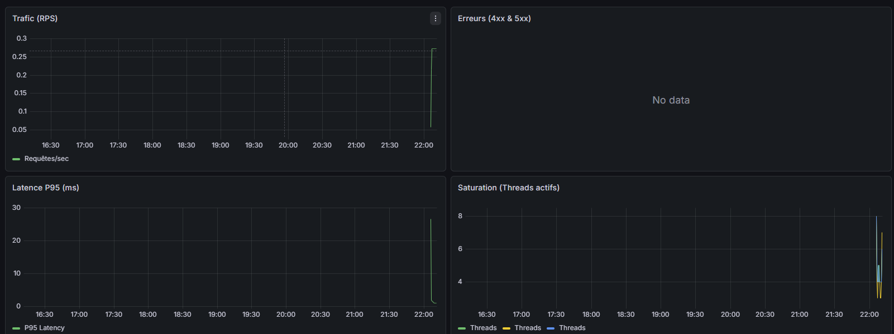

Pendant test:
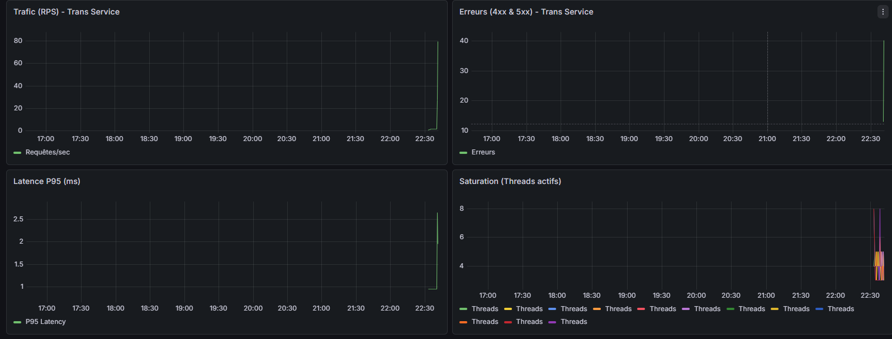

Post test: 

Ecran NBomber:
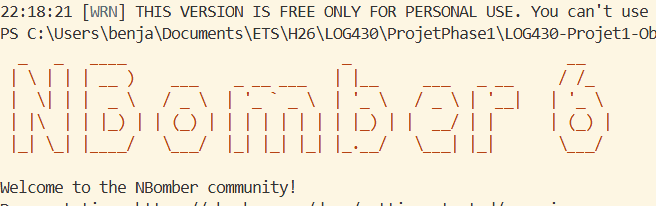
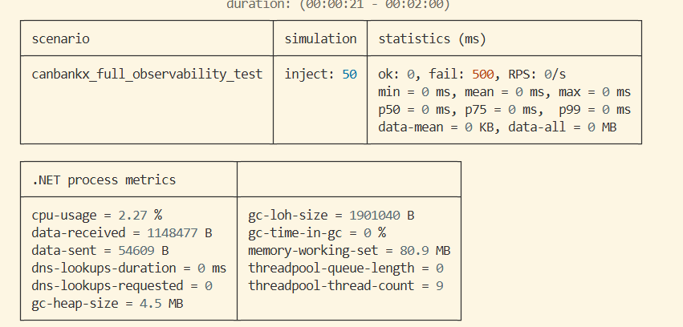


Resultat premier Test:
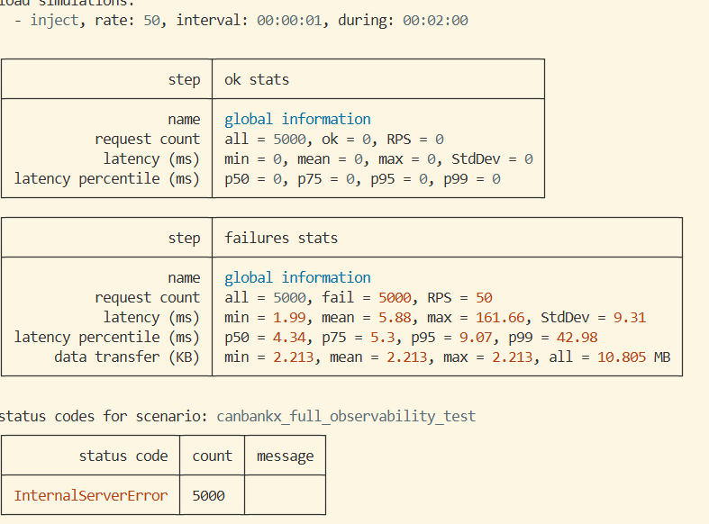


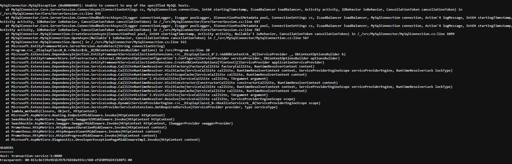

## 5. Conteneuristation
### 5.1. Docker
Les dockers des services présentées ont été programmés dans l'optique de conserver leurs intégrités. Ils sont tous indépendants l'un de l'autre et pourtant arrivent à réaliser une application qui permet de réalisé les cas d'utilisation demandés. Chacun des conteneurs de services (Gateway, Authentification et Tansaction) ont leur propres engin d'observation ce qui permet de comprendre l'usage de chacun des services. La conservation des docker compose et les tests emis dans ceux-ci sont définitivement un point fort de ce projet. De plus, pour les services avec moins d'interactions comme les base de données. Les fichier compose sont adaptés aux besoins. 

Voici un exemple de docker compose pour l'auth-service : 
```
services:
  auth-service:
    build:
      context: .
      dockerfile: CanBankX_AuthService/Dockerfile
    container_name: auth-service
    ports:
      - "5000:8080"
    environment:
      - ConnectionStrings__DefaultConnection=Server=mysql-db;Port=3306;Database=CanBankXClientDB;Uid=root;Pwd=root;
      - ASPNETCORE_ENVIRONMENT=Development
      - ASPNETCORE_URLS=http://+:8080
    networks:
      - canbankx_net
    healthcheck:
      test: ["CMD", "curl", "-f", "http://localhost:8080/health"]
      interval: 10s
      timeout: 5s
      retries: 5
      start_period: 20s

  auth-service-tests:
    build:
      context: .
      dockerfile: CanBankX_AuthService/Dockerfile
      target: build
    container_name: auth-service-tests
    command: dotnet test CanBankX_AuthService.Tests/CanBankX_AuthService.Tests.csproj --logger:trx --results-directory /app/test-results
    volumes:
      - ./test-results:/app/test-results
    networks:
      - canbankx_net
    depends_on:
      auth-service:
        condition: service_healthy

  prometheus:
    image: prom/prometheus:latest
    container_name: prometheus-auth
    volumes:
      - ./prometheus.yml:/etc/prometheus/prometheus.yml
    ports:
      - "9091:9090"
    networks:
      - canbankx_net
    depends_on:
      auth-service:
        condition: service_healthy

  grafana:
    image: grafana/grafana:latest
    container_name: grafana-auth
    ports:
      - "3001:3000"
    volumes:
      - ./deploy/grafana/provisioning/datasources:/etc/grafana/provisioning/datasources
      - ./deploy/grafana/provisioning/dashboards:/etc/grafana/provisioning/dashboards
    networks:
      - canbankx_net
    depends_on:
      - prometheus

networks:
  canbankx_net:
    name: log430-projet1-clientbd_CanBankX-network
    external: true
```
Voici un exemple de docker compose pour une base de données :
```
services:
  mysql-db:
    build: .
    env_file:
      - .env
    image: mysql:8.4.0
    restart: unless-stopped
    environment:
      MYSQL_ROOT_PASSWORD: ${MYSQL_ROOT_PASSWORD}
      MYSQL_DATABASE: ${MYSQL_DATABASE}
      MYSQL_USER: ${MYSQL_USER}
      MYSQL_PASSWORD: ${MYSQL_PASSWORD}
    networks:
      - CanBankX-network
    ports:
      - "3306:3306"
    volumes:
      - mysql_data:/var/lib/mysql
      - ./src:/docker-entrypoint-initdb.d      
    healthcheck:
      test: ["CMD-SHELL", "mysqladmin ping -h localhost -u root -proot"]
      interval: 10s
      timeout: 5s
      retries: 5

networks:
  CanBankX-network:
    name: log430-projet1-clientbd_CanBankX-network
    external: true
    driver: bridge

volumes:
  mysql_data:
```

### 5.2. CI/CD
Afin de conserver des services authentification et transaction à jour, le fichier de CI de chacun de ces services contient un appel des sous modules qui facilitent l'intégration du services AML. De cette manière, il est possible de corriger certains éléments de la sécurité en parallèle aux services qui en ont besoin. 

voici un exemple de fichier CI qui permet de comprendre le pipeline: 
```
name: Docker Image CI

on:
  push:
    branches: [ "main" ]
  pull_request:
    branches: [ "main" ]

jobs:

  build:
    runs-on: ubuntu-latest

    steps:
    - uses: actions/checkout@v4
      with: 
        submodules: 'recursive'
        fetch-depth: 0
    
    - name: Update submodules
      run: git submodules update --remote --recursive

    - name: Build the Docker image
      run: docker build . --file Dockerfile --tag my-image-name:$(date +%s)

```

## 6. Documentation de l'API Rest

Concernant l'API Rest, les deux services majeurs: authentification et transaction, ont leurs services swagger sur les routes suivantes : 

http://localhost:5000/canbankx/index.html

http://localhost:5260/canbankx/index.html

Chacun des trois services ont leurs collection de routes postman aux routes suivantes: \docs\PostmanCollection\Collection.json

Le tout a été nommée en conformité aux standards du libre RestAPI de Mark Massé. 

## 7. Réflexion sur le travail réalisé et les étapes suivante
La charge est gigantesque. Je n'ai pas pu tout réalisé. 

J'ai décidé de prendre la dernière heure du projet pour faire le point sur l'épopée que je viens de vivre. À cette étape, une heure de plus est un verre d'eau dans l'océan. Ce sera une lettre ouverte.
  
Quel acharnement. 

En tout honnêteté, la première étape du projet a été de lire l'ensemble du cahier de charge ainsi que de comprendre chacun des mots qui y était écrit. M'assurer que lors de la production, je puisse comprendre ce qu'y était à réaliser avant de le faire. Le résultat, les tests de chargent ne fonctionnent pas. La documentation est partielle. La cache est minime. Le UI est inexistant. Et pourtant, je ne vois pas comment j'aurais pu en faire plus. Toutefois, je comprends les mots de l'énoncé maintenant. 

Je remets le travail avec un sentiment que j'aurais pu en faire plus. Je vois pas comment, mais j'aurais pu. 

Des fois je me dis que c'est ce que vous voulez qu'on apprenne. Ce sentiment du conditionnel. De ce qui peut être réalisé et de s'y rendre. De se pousser à y arriver afin de pouvoir y croire. De faire le pont entre ce qui est et ce qui pourrait être. Cette fois ci je n'ai pas pu y arriver. 

De manière plus sérieuse, je dois retester mes routes, m'assurer que mes tests de chargent fonctionnent et refaire un UI. 

Je suis content du match que j'ai joué, mais j'ai perdu. 

Merci Fabio.
